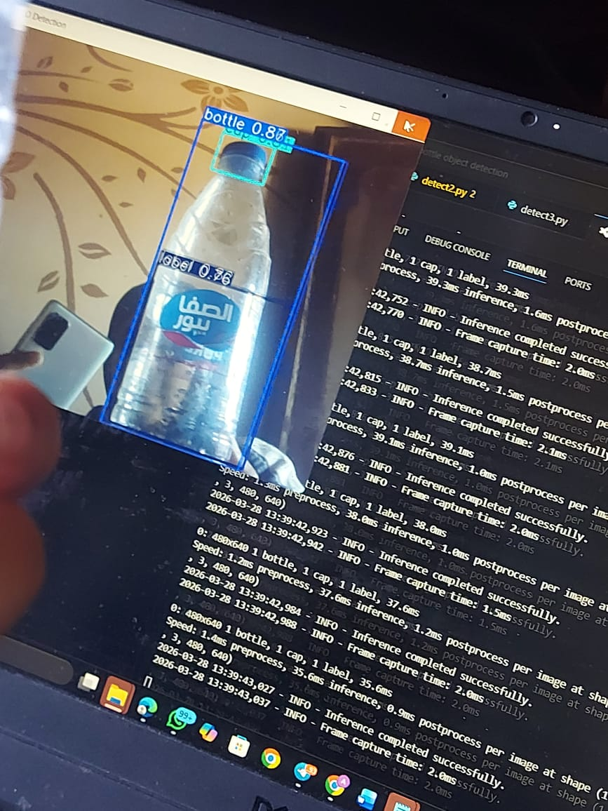

# AI-Based Bottle Inspection & Quality Control System

[](1-bottle.jpeg)

---

## 🚀 Project Overview

This project implements a **small-scale production line** using **Artificial Intelligence (AI)** and **computer vision** techniques. Its main goal is to develop a **smart, low-cost prototype** capable of detecting common defects in bottles, including:

- Cap misalignment  
- Missing or incorrect labels  
- Improper fill levels  

Traditional manual inspection processes are often **time-consuming, error-prone, and inefficient**, leading to:

- Increased waste  
- Higher operational costs  
- Reduced customer satisfaction  

This AI-driven system aims to solve these challenges by providing **real-time, automated inspection**.

---

## 🛠 System Components

- **Raspberry Pi 5** with camera-based vision  
- **Capacitive sensing** for advanced detection  
- **AI model (`best.pt`)** for defect recognition  
- **Defect logging mechanism** for tracking issues  
- **Simulated PLC-based rejection system**  
- Maintenance alerts triggered when defect rates exceed thresholds  

The system is designed to **reduce material waste**, improve **energy efficiency**, and support **Industry 4.0** initiatives.

---

## 📦 Project Files

| File Name | Description |
|-----------|-------------|
| `detect3.py` | Main detection script to run bottle inspection |
| `best.pt` | Trained AI model for defect detection |
| `quantization.py` | Quantized version of the model for efficiency |

---

## 🖼 Sample Output Image

Here’s an example of the system detecting a bottle:


---

## 🎥 Demo Video

Watch the AI inspection system in action:

<video width="720" height="480" controls>
  <source src="Video-Demo-Bottle.mp4" type="video/mp4">
  Your browser does not support the video tag.
</video>

---

## ⚙️ How to Run

1. **Install dependencies** (Python 3.10+ recommended):
```bash
pip install -r requirements.txt
